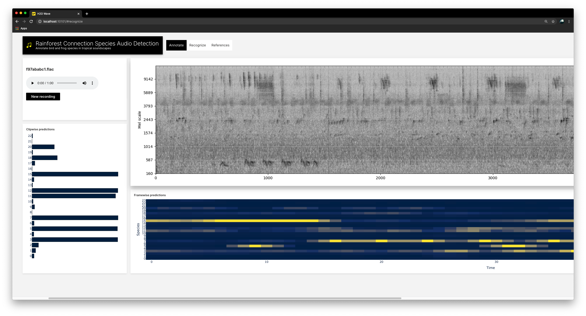

## Setup
Clone the repo and create python environment with the required dependencies.
```
python -m venv venv
source venv/bin/activate
python -m pip install --upgrade pip
pip install -r requirements.txt
# You might need ffmpeg/libsndfile or other system dependencies to get librosa working
```
Download & extract [Wave](https://github.com/h2oai/wave/releases/tag/v0.11.0)


**Optional** Download  all the required audio chunks and pretrained model from kaggle.
```
kaggle datasets download gaborfodor/rainforestexampleaudiochunks
mv rainforestexampleaudiochunks.zip data/
unzip data/rainforestexampleaudiochunks.zip
```
 

## Run the app
1. Start the Wave development server: `$ ./waved`
2. Start the app: `$ wave run rainforest.dashboard`
3. Go to http://localhost:10101/

# Annotate
Select any species and fix the collected labels.


# Recognize
Upload your own rainforest recording and analyze it with a single pretrained CNN14 model.

